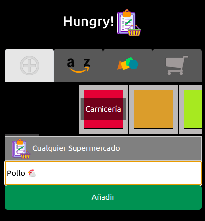
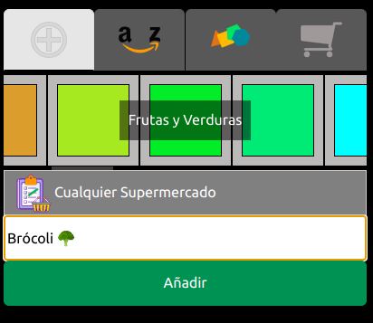
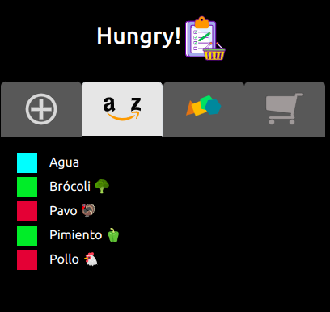
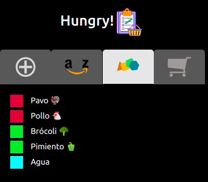

# Bienvenido a Hungry! by trystan4861

¡Gracias por elegir nuestra aplicación! «Hungry!» es una herramienta poderosa diseñada para realizar listas de la compra con diversas funcionalidades.
Está inspirada en una aplicación (ya retirada de la appstore) llamada igualmente «Hungry!» pero con divesas mejoras.

## Características Principales

- **Funcionalidad 1:** Permite crear distintos productos, asignándoles una categoría y un supermercado específico para su posterior compra.
- **Funcionalidad 2:** Es totalmente responsive y permite modificar tanto los productos como los nombres de las categorías.
- **Funcionalidad 3:** En continuo desarrollo y mejora.

## Capturas de Pantalla

Aquí tienes algunas imágenes que muestran la interfaz de usuario de nuestra aplicación:

## Instalación

Para instalar y ejecutar [Nombre de tu Aplicación], sigue estos pasos:

1. Clona este repositorio en tu máquina local.
2. Instala las dependencias utilizando el gestor de paquetes de tu preferencia.
3. Ejecuta la aplicación utilizando el comando `npm start` o `yarn start`.
4. ¡Disfruta de «Hungry!¢!

## Uso

Aquí tienes algunas instrucciones básicas sobre cómo utilizar nuestra aplicación:

1. Abre la aplicación desde tu navegador web.
2. Explora las diferentes secciones y características.
3. Interactúa con los elementos de la interfaz de usuario para realizar acciones específicas.
4. ¡Experimenta y diviértete!

## Tecnologías Utilizadas

- **Frontend:** [HTML, CSS, JavaScript, VUE3].
- **Backend:** [Vite]

## Contribución

¡Nos encantaría que contribuyeras a mejorar «Hungry!»! Si tienes ideas, sugerencias o correcciones, no dudes en enviarnos una solicitud de extracción o informar un problema en nuestro repositorio de GitHub.

## Créditos

- Desarrollado por [Trystan4861](https://github.com/Trystan4861/).
- Logotipos e imágenes diseñados por [Trystan4861](https://github.com/Trystan4861/) usando [Boxy.svg](https://boxy-svg.com/app).
- Agradecimientos especiales a los creadores originales de la app Hungy! para Android.

## Licencia

«Hungry!» está bajo la Licencia Creative Commons Atribución 4.0 Internacional (CC BY 4.0). Para más detalles, consulta el archivo LICENSE.md.

## Contacto

Si tienes alguna pregunta, sugerencia o comentario, no dudes en ponerte en contacto con el autor en sus vías de contacto publicadas.

¡Gracias por tu interés en «Hungry!» Esperamos que disfrutes usándola tanto como nosotros disfrutamos creándola.
